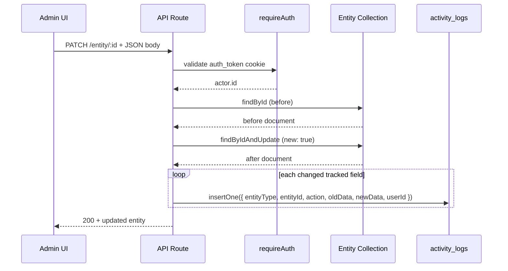

# Activity Log — Flow & Architecture

> Audit trail for all core entities in Zan Workspace.  
> Model: `src/models/ActivityLog.ts` · Collection: `activity_logs`

---

## 1. Purpose

Automatically record **who** changed **what field** on **which record**, without building a separate logging API for every change. Logs are written to MongoDB after successful create/update/delete operations in existing API routes.

This is **not** HTTP/page middleware. It runs **inside API route handlers** (and webhooks) immediately after the primary database write succeeds.

---

## 2. Schema

| Field        | Type       | Required | Description |
|-------------|------------|----------|-------------|
| `entityType` | `String` (enum) | Yes | Domain of the changed record |
| `entityId`   | `ObjectId` | Yes | `_id` of that record |
| `action`     | `String`   | Yes | **Field name** that changed (e.g. `email`, `status`) |
| `oldData`    | `Mixed`    | No  | Value before the change |
| `newData`    | `Mixed`    | No  | Value after the change |
| `userId`     | `ObjectId` | No  | User who performed the action (ref `User`) |
| `createdAt`  | `Date`     | Auto | From `timestamps: true` |
| `updatedAt`  | `Date`     | Auto | From `timestamps: true` |

### `entityType` enum (all monitored entities)

```
USER | LEAD | CLIENT | PROJECT | INTERACTION | CALL | MEETING | DOCUMENT | QUOTATION
```

---

## 3. Logging rules

### 3.1 UPDATE (primary case)

1. Load document **before** update.
2. Perform update (`findByIdAndUpdate` with `{ new: true }` or `.save()`).
3. Compare each **tracked field** between `before` and `after`.
4. For every field that changed → insert **one** `ActivityLog` row.

| Field        | Meaning |
|-------------|---------|
| `entityType` | e.g. `USER` |
| `entityId`   | Target record `_id` (e.g. user being edited) |
| `action`     | Field name, e.g. `email` |
| `oldData`    | Previous value (scalar in DB) |
| `newData`    | New value (scalar in DB) |
| `userId`     | Actor from `requireAuth(req).id` |

**Example:** Sribabu updates Sumitabha’s email only.

| Field        | Value |
|-------------|--------|
| `entityType` | `USER` |
| `entityId`   | Sumitabha’s `_id` |
| `action`     | `email` |
| `oldData`    | `sumitabha4@gmail.com` |
| `newData`    | `sumitabha8@gmail.com` |
| `userId`     | Sribabu’s `_id` |

If **name**, **email**, and **role** change in one request → **3** documents in `activity_logs`.

### 3.2 CREATE

Pick one convention and use it project-wide:

| Option | Behavior |
|--------|----------|
| **A — Per field** | One row per tracked field: `action` = field name, `oldData` null/omitted, `newData` = initial value |
| **B — Single row** | One row: `action` = `"CREATE"`, `newData` = full snapshot object |

**Recommendation:** Option A (consistent with UPDATE).

### 3.3 DELETE

| Option | Behavior |
|--------|----------|
| **A** | `action` = `"DELETE"`, `oldData` = last snapshot, `newData` null |
| **B** | One row per field from soft-delete payload |

For soft deletes (`deletedAt`), log `action: "deletedAt"` with old `null` and new date.

### 3.4 Never log

| Field / data | Reason |
|--------------|--------|
| `password` | Security — never store plain or hash in audit |
| JWT / tokens | Security |
| Optional: `lastLoginAt` | Noise unless required for compliance |
| Optional: `updatedAt` / `createdAt` | Usually redundant (log has its own `createdAt`) |

For password changes, either skip entirely or log `action: "password"` with `oldData`/`newData` as `"[REDACTED]"`.

---

## 4. High-level architecture

```
┌─────────────┐     ┌──────────────────┐     ┌─────────────────────┐
│  Admin UI   │────▶│  API route       │────▶│  Entity collection  │
│             │     │  requireAuth()   │     │  (users, leads, …)  │
└─────────────┘     └────────┬─────────┘     └─────────────────────┘
                             │
                             │  on successful write
                             ▼
                    ┌──────────────────┐
                    │ logEntityChanges │  ← shared helper
                    └────────┬─────────┘
                             │
                             ▼
                    ┌──────────────────┐
                    │  activity_logs   │
                    └──────────────────┘
```

### Planned module layout

```
src/lib/activity-log/
  ├── types.ts              # EntityType, LogActivityInput, LogEntityChangesInput
  ├── registry.ts           # trackedFields + skipFields per entityType
  ├── normalize.ts          # dates, ObjectIds, arrays → comparable values
  ├── logActivity.ts        # insert single row
  └── logEntityChanges.ts   # diff before/after → N rows
```

---

## 5. Per-request sequence (UPDATE)

```
1.  PATCH /api/admin/operations/.../:id
2.  const actor = await requireAuth(req)
3.  await dbConnect()
4.  const before = await Model.findById(id).lean()
5.  Validate request body
6.  const after = await Model.findByIdAndUpdate(id, body, {
      new: true,
      runValidators: true,
    })
7.  await logEntityChanges({
      entityType: "CLIENT",
      entityId: after._id,
      userId: actor.id,
      before,
      after,
      fields: ENTITY_AUDIT_CONFIG.CLIENT.trackedFields,
    })
8.  return NextResponse.json({ success: true, data: after })
```

| Step fails | Activity logs |
|------------|-----------------|
| Step 6 (DB update) | None |
| Step 7 (logging) | Decide policy: log error + still return 200, or fail request |

**Recommendation:** Log errors to console; do not roll back the business update if audit insert fails.

---

## 6. Actor (`userId`)

| Source | `userId` |
|--------|----------|
| Authenticated admin API | `requireAuth(req).id` |
| Facebook lead webhook | `null` or dedicated system user `_id` |
| Seed / bootstrap scripts | `null` or bootstrap admin `_id` |

Populate `userId` with `new mongoose.Types.ObjectId(actor.id)` when present.

---

## 7. Entity registry (monitor all types)

Central config drives which fields are diffed per `entityType`. Adjust lists as product needs change.

### USER

| Tracked | Skip |
|---------|------|
| `name`, `email`, `role`, `isActive`, `avatar`, `createdBy`, `deletedAt` | `password`, `lastLoginAt` |

**Routes:** `POST /api/admin/operations/users`, profile avatar/password (redact password), future `PATCH users/[id]`.

### LEAD

| Tracked | Skip |
|---------|------|
| `name`, `email`, `phone`, `source`, `status`, `assignedTo`, `convertedClientId`, `lastInteractionAt`, `lastInteractionId`, `createdBy`, `deletedAt` | — |

**Routes:** `POST leads`, `PATCH leads/[id]`, `PATCH leads/[id]/status`, `POST leads/[id]/convert`, `POST webhooks/facebook/leads`.

### CLIENT

| Tracked | Skip |
|---------|------|
| `name`, `company`, `email`, `phone`, `status`, `lastInteractionAt`, `lastInteractionId`, `createdBy` | — |

**Routes:** `POST clients`, `PATCH clients/[id]`, `PATCH clients/[id]/status`, `convert` (creates client).

### PROJECT

| Tracked | Skip |
|---------|------|
| `clientId`, `companyName`, `title`, `description`, `serviceType`, `status`, `budget`, `lastInteractionAt`, `lastInteractionId`, `createdBy` | — |

**Routes:** `POST projects`, `PATCH projects/[id]`, `PATCH projects/[id]/status`.

### INTERACTION

| Tracked | Skip |
|---------|------|
| `entityType`, `entityId`, `type`, `title`, `description`, `refId`, `createdBy` | — |

**Routes:** `POST interactions`, `POST notes`, status routes that create interactions.

### CALL

| Tracked | Skip |
|---------|------|
| `entityType`, `entityId`, `contactPersonName`, `contactPersonPhone`, `callTime`, `duration`, `recordingUrl`, `notes`, `direction`, `status`, `createdBy` | — |

**Routes:** `POST calls` (+ cascade updates on LEAD/CLIENT/PROJECT — see §8).

### MEETING

| Tracked | Skip |
|---------|------|
| `entityType`, `entityId`, `title`, `agenda`, `description`, `meetingType`, `meetingLink`, `attendees`, `scheduledAt`, `status`, `outcome`, `createdBy` | `rescheduleHistory`, `external` (or log as JSON if needed) |

**Routes:** `POST meetings` (+ cascade updates).

### QUOTATION

| Tracked | Skip |
|---------|------|
| `entityType`, `entityId`, `title`, `amount`, `gst_percentage`, `url`, `status`, `uploadedBy`, `createdBy` | — |

**Routes:** `POST quotations` (+ cascade updates).

### DOCUMENT

| Tracked | Skip |
|---------|------|
| `clientId`, `projectId`, `title`, `type`, `url`, `uploadedBy` | — |

**Routes:** None today (model read in interaction timelines only). Wire when upload/create API exists.

---

## 8. Cascade / side-effect writes

Several routes create a **CALL**, **MEETING**, **NOTE**, or **QUOTATION** and also run `findByIdAndUpdate` on **LEAD**, **CLIENT**, or **PROJECT** (e.g. `lastInteractionAt`, status).

For full coverage, log **both**:

1. **Primary entity** — e.g. new `CALL` document (CREATE logs).
2. **Secondary entity** — if LEAD/CLIENT/PROJECT fields actually changed (UPDATE logs per field).

| Route pattern | Primary `entityType` | May also log |
|---------------|---------------------|--------------|
| `calls/route.ts` | `CALL` | `LEAD` / `CLIENT` / `PROJECT` |
| `meetings/route.ts` | `MEETING` | same |
| `notes/route.ts` | `INTERACTION` | same |
| `quotations/route.ts` | `QUOTATION` | same |
| `leads/[id]/status` | `LEAD` | `INTERACTION` (if created) |
| `clients/[id]/status` | `CLIENT` | `INTERACTION` |
| `projects/[id]/status` | `PROJECT` | `INTERACTION` |
| `leads/[id]/convert` | `LEAD` + `CLIENT` | transaction — log after commit |

---

## 9. `logEntityChanges` (reference implementation)

```ts
import ActivityLog from "@/models/ActivityLog"
import mongoose from "mongoose"
import { valuesEqual } from "./normalize"

type EntityType =
  | "USER" | "LEAD" | "CLIENT" | "PROJECT" | "INTERACTION"
  | "CALL" | "MEETING" | "DOCUMENT" | "QUOTATION"

export async function logEntityChanges(input: {
  entityType: EntityType
  entityId: mongoose.Types.ObjectId | string
  userId?: string | null
  before: Record<string, unknown> | null
  after: Record<string, unknown> | null
  fields: readonly string[]
}) {
  const { entityType, entityId, userId, before, after, fields } = input
  const entityObjectId = new mongoose.Types.ObjectId(entityId)
  const userObjectId = userId ? new mongoose.Types.ObjectId(userId) : undefined

  const ops = []

  for (const field of fields) {
    const oldVal = before?.[field]
    const newVal = after?.[field]

    if (!valuesEqual(oldVal, newVal)) {
      ops.push({
        entityType,
        entityId: entityObjectId,
        action: field,
        oldData: oldVal ?? null,
        newData: newVal ?? null,
        ...(userObjectId && { userId: userObjectId }),
      })
    }
  }

  if (ops.length > 0) {
    await ActivityLog.insertMany(ops)
  }
}
```

### CREATE helper (concept)

```ts
export async function logEntityCreate(input: {
  entityType: EntityType
  entityId: string
  userId?: string | null
  after: Record<string, unknown>
  fields: readonly string[]
}) {
  await logEntityChanges({
    ...input,
    before: null,
    after: input.after,
  })
}
```

---

## 10. API routes checklist

Use this when rolling out logging.

### USER

- [ ] `src/app/api/admin/operations/users/route.ts` — POST
- [ ] `src/app/api/auth/profile/avatar/route.ts`
- [ ] `src/app/api/auth/profile/password/route.ts` (redact)
- [ ] Future PATCH `users/[id]`

### LEAD

- [ ] `src/app/api/admin/operations/leads/route.ts` — POST
- [ ] `src/app/api/admin/operations/leads/[id]/route.ts` — PATCH
- [ ] `src/app/api/admin/operations/leads/[id]/status/route.ts`
- [ ] `src/app/api/admin/operations/leads/[id]/convert/route.ts`
- [ ] `src/app/api/webhooks/facebook/leads/route.ts`

### CLIENT

- [ ] `src/app/api/admin/operations/clients/route.ts` — POST
- [ ] `src/app/api/admin/operations/clients/[id]/route.ts` — PATCH
- [ ] `src/app/api/admin/operations/clients/[id]/status/route.ts`

### PROJECT

- [ ] `src/app/api/admin/operations/projects/route.ts` — POST
- [ ] `src/app/api/admin/operations/projects/[id]/route.ts` — PATCH
- [ ] `src/app/api/admin/operations/projects/[id]/status/route.ts`

### INTERACTION

- [ ] `src/app/api/admin/operations/interactions/route.ts`
- [ ] `src/app/api/admin/operations/notes/route.ts`

### CALL / MEETING / QUOTATION

- [ ] `src/app/api/admin/operations/calls/route.ts`
- [ ] `src/app/api/admin/operations/meetings/route.ts`
- [ ] `src/app/api/admin/operations/quotations/route.ts`

### DOCUMENT

- [ ] Add when create/update API exists

---

## 11. Read path (phase 2 — optional)

Expose logs in admin UI:

```
GET /api/admin/operations/activity-logs?entityType=USER&entityId=<id>&page=1&limit=50
```

Response: list with populated `userId` (`name`, `email`), sorted by `createdAt` desc.

UI: timeline on user / lead / client / project detail pages.

---

## 12. Sequence diagram (UPDATE)



---

## 13. Rollout order

| Phase | Work |
|-------|------|
| 1 | `types.ts`, `normalize.ts`, `registry.ts`, `logActivity.ts`, `logEntityChanges.ts` |
| 2 | Wire **CLIENT** `PATCH` — verify rows in Atlas |
| 3 | LEAD, CLIENT, PROJECT — create + update + status |
| 4 | CALL, MEETING, QUOTATION, INTERACTION + cascades |
| 5 | USER create + profile; webhook system actor |
| 6 | DOCUMENT when API exists |
| 7 | GET activity-logs + UI timeline |

---

## 14. Open decisions (confirm before implementation)

| # | Question | Options |
|---|----------|---------|
| 1 | CREATE logging | Per-field vs single `CREATE` row |
| 2 | DELETE / soft-delete | `deletedAt` field log vs `action: "DELETE"` |
| 3 | `oldData` / `newData` shape | Scalar per field (recommended) vs full document snapshot |
| 4 | Audit insert failure | Fail HTTP request vs log error only |
| 5 | Skip list | `lastLoginAt`, Mongoose `__v`, etc. |
| 6 | System actor | `userId: null` vs fixed system user document |

---

## 15. Related files

| File | Role |
|------|------|
| `src/models/ActivityLog.ts` | Mongoose schema |
| `src/lib/auth/requireAuth.ts` | Actor for `userId` |
| `src/app/api/admin/operations/**/route.ts` | Integration points |
| `src/lib/activity-log/*` | Helpers (to be added) |

---

*Last updated: project planning doc — implementation may diverge slightly once helpers land in `src/lib/activity-log/`.*
